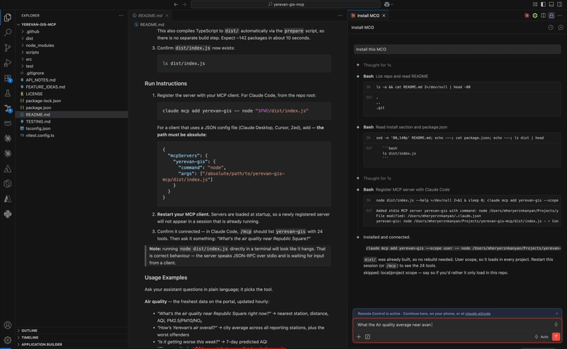

<!-- Header block for project -->
<hr>

<div align="center">

<h1 align="center">yerevan-gis-mcp</h1>

</div>

<pre align="center">An MCP server that lets an AI agent query Yerevan's live municipal GIS data — air quality, parcels, zoning, construction, transport — with no API key.</pre>

<!-- Header block for project -->

[](https://github.com/mheryerznkanyan/yerevan-gis-mcp/actions/workflows/test.yml)
[](LICENSE)
[](https://nodejs.org)
[](https://modelcontextprotocol.io)
[](https://nasa-ammos.github.io/slim/)

This project wraps the **Yerevan Municipality GIS portal** ([gis.yerevan.am](https://gis.yerevan.am/portal/home/index.html)) — an ArcGIS Enterprise 11.5 deployment with ~190 hosted layers and 300+ portal items — in a Model Context Protocol server, so a language model can answer real questions about the city from live data instead of guessing.

It exists because the portal is genuinely open: every layer this server touches is served **anonymously, with no token, no account and no rate limit**. That openness is buried behind an ArcGIS REST API with a bespoke unnamed projection, Armenian free-text categories, non-zero layer ids and numbers-encoded-as-strings. This server absorbs all of that so the model sees clean JSON, WGS84 coordinates and local timestamps.

It is intended for anyone building an AI assistant that needs to reason about Yerevan — urbanists, journalists, civic-tech developers, or a resident asking whether it is safe to go running today. Everything is **read-only**; the server never calls `applyEdits`.

[Yerevan GIS portal](https://gis.yerevan.am/portal/home/index.html) | [Testing report](TESTING.md) | [API notes](API_NOTES.md) | [Feature ideas](FEATURE_IDEAS.md) | [Issue tracker](https://github.com/mheryerznkanyan/yerevan-gis-mcp/issues)



## Features

* **28 tools** over live city data — 26 over the municipal portal / OpenStreetMap (verified end-to-end, see [TESTING.md](TESTING.md)), plus two live-transit scrapes
* **Live vehicle positions** — real-time bus/trolleybus/minibus locations scraped from Yandex Maps via a headless browser, either near a point (`get_live_transit`) or the *whole* active city fleet de-duplicated across a grid sweep (`get_active_fleet`, ~750 vehicles); the headless browser these need is fetched automatically the first time you use them (nothing to install up front), but the scrape itself is fragile and subject to Yandex's terms of use (see the note below)
* **No credentials of any kind** — no API key, token, account or config file; clone and run
* **Live air quality** from 222 sensors, plus a 7-day AQI forecast and hourly per-station history
* **181,341 cadastral parcels** and 12 districts, queryable by cadastral code or by lon/lat
* **Point-in-polygon lookups** — "what parcel / zone / district is at this coordinate?"
* **A generic ArcGIS toolbox** that reaches *any* of the portal's ~190 layers, not just the curated ones
* **The sharp edges handled for you** — WGS84 reprojection from an unnamed source projection, auto-pagination past the 2,000-row server cap, epoch-ms → UTC+4 timestamps, string-encoded numbers, Armenian field aliases
* **English district names accepted** and mapped to their Armenian equivalents
* **Sub-second responses** for most tools (1–4 ms for catalog lookups, 330–700 ms for single queries)

## Contents

* [Quick Start](#quick-start)
* [Tools](#tools)
* [Notes on the Data](#notes-on-the-data)
* [Changelog](#changelog)
* [FAQ](#frequently-asked-questions-faq)
* [Contributing](#contributing)
* [License](#license)
* [Support](#support)

## Quick Start

### Requirements

1. **Node.js 20 or newer** (developed and tested on Node 22; CI covers 20 and 22)
2. **npm** (ships with Node)
3. **Ordinary internet access** to `gis.yerevan.am` — restricted CI or sandbox networks will block the live queries
4. **An MCP client** — Claude Code, Claude Desktop, Cursor, Zed, or anything else that speaks MCP over stdio
5. *(Optional, only for the two live-transit tools)* **~150 MB of disk for a headless Chromium.** It is **not** downloaded by `npm install` — the transit tools fetch it automatically on first use (or pre-fetch it with `npm run install:browser`). Every other tool works without it. See [Live transit needs a browser](#live-transit-needs-a-browser).

No API key, token or account is required.

### Setup Instructions

1. Clone the repository and enter it:

   ```bash
   git clone https://github.com/mheryerznkanyan/yerevan-gis-mcp.git
   cd yerevan-gis-mcp
   ```

2. Install dependencies:

   ```bash
   npm install
   ```

   Fast and self-contained: ~144 packages in about 10 seconds, plus a TypeScript build into `dist/` via the `prepare` script. No browser download, no separate build step — the server is ready as soon as this finishes.

   The two live-transit tools need a headless Chromium; it is fetched automatically the first time you call one (or run `npm run install:browser` to pre-fetch it). The other 26 tools need nothing further — see [Live transit needs a browser](#live-transit-needs-a-browser).

3. Confirm `dist/index.js` now exists:

   ```bash
   ls dist/index.js
   ```

### Run Instructions

1. Register the server with your MCP client. For Claude Code, from the repo root:

   ```bash
   claude mcp add yerevan-gis -- node "$PWD/dist/index.js"
   ```

   For a client that uses a JSON config file (Claude Desktop, Cursor, Zed), add — **the path must be absolute**:

   ```json
   {
     "mcpServers": {
       "yerevan-gis": {
         "command": "node",
         "args": ["/absolute/path/to/yerevan-gis-mcp/dist/index.js"]
       }
     }
   }
   ```

2. **Restart your MCP client.** Servers are loaded at startup, so a newly registered server will not appear in a session that is already running.

3. Confirm it connected — in Claude Code, `/mcp` should list `yerevan-gis` with 28 tools. Then ask it something: *"What's the air quality near Republic Square?"*

> **Note:** running `node dist/index.js` directly in a terminal will look like it hangs. That is correct behaviour — the server speaks JSON-RPC over stdio and is waiting for input from a client.

### Usage Examples

Ask your assistant questions in plain language; it picks the tool.

**Air quality** — the freshest data on the portal, updated hourly:

* *"What's the air quality near Republic Square right now?"* → nearest station, distance, AQI, PM2.5/PM10/NO₂
* *"How's Yerevan's air overall?"* → city average across all reporting stations, plus the worst offenders
* *"Is it getting worse this week?"* → 7-day predicted AQI
* *"Show me the last 24 hours at that sensor."* → hourly time series

**Cadastre, zoning and construction:**

* *"What parcel and zoning is at 40.1776, 44.5136?"* → cadastral code, district, area in m², land-use designation
* *"How many buildings are in Erebuni?"* → parcel / building / construction counts for the district
* *"List active construction sites in Kentron."* → address, developer, permit expiry, coordinates

**Places, transport and addressing:**

* *"Where are the nearest bus stops / metro stations / kindergartens?"*
* *"Which streets contain Բաղրամյան?"*
* *"What public dashboards does the municipality publish?"*

**Anything not curated** — the generic toolbox reaches all ~190 layers:

* *"What datasets exist about forests?"* → `search_layers`, then query whatever it returns
* *"Count parcels grouped by community."* → server-side aggregation

Two things it deliberately cannot do: **resolve a street address to coordinates** (the portal's geocoder requires a token, so you supply lon/lat or an Armenian street name), and **routing or travel time** (not in the data).

### Build Instructions

`npm install` already builds the project. After editing source, rebuild with:

```bash
npm run build      # tsc → dist/
npm run typecheck  # type-check without emitting
```

For iterating without a build step, run the TypeScript directly:

```bash
npm run dev        # tsx src/index.ts
```

### Live transit needs a browser

`get_live_transit` and `get_active_fleet` drive a headless Chromium — Yandex signs the vehicle
request from its own JavaScript, so the page has to make it. **`npm install` does not download it** —
that keeps install fast, and the other 26 tools never touch a browser. The Chromium is fetched only
when you first use a transit tool, at three points, so nothing is needed up front:

1. **On first call** — the tool downloads Chromium once (~150 MB), then retries. One download per
   process, however many calls arrive at once. Depending on `playwright-core` (not full `playwright`)
   keeps this to *only* Chromium; full Playwright would pull Firefox and WebKit too, ~500 MB you'd
   never use.
2. **As a fallback** — if the download is blocked, it launches a Chrome-family browser you already
   have: system Chrome, Chromium, then Edge. In a container or CI runner, where Chromium's own
   sandbox cannot start, it retries with `--no-sandbox`.

Only if both miss does a transit tool return an error, and it names every route it tried plus the
one-line fix.

Prefer to pay that ~150 MB once, up front, rather than on the first transit call? Pre-fetch it:

```bash
npm run install:browser     # → playwright install chromium
```

Environment variables, for locked-down setups:

| Variable | Effect |
| --- | --- |
| `YEREVAN_GIS_BROWSER_PATH` | Absolute path to a Chrome/Chromium binary. Tried first; skips the download and search entirely. |
| `YEREVAN_GIS_NO_AUTO_INSTALL=1` | Never download at call time — fail with an explanation (and the system-browser fallback) instead. |

### Test Instructions

1. **Unit tests** — fully offline, against faked HTTP responses:

   ```bash
   npm test
   ```

   Expected: `Test Files 5 passed (5)`, `Tests 33 passed (33)`, in well under a second.

2. **Live smoke test** — hits the real portal, needs normal internet egress:

   ```bash
   npm run smoke
   ```

   Expected: `11 passed, 0 failed.` It checks district and parcel counts, WGS84 reprojection, point-in-polygon zoning, grouped aggregation, distinct values, near-point search, Armenian street search, portal search, restricted-layer handling, and that all 41 catalogued layers are describe-able.

Both run automatically on every pull request via GitHub Actions (Node 20 and 22); the live smoke test runs
weekly instead, so an upstream portal outage never blocks a PR.

See [TESTING.md](TESTING.md) for the full testing architecture — each category, how to run it, and a dated
verification report with measured latencies and known rough edges.

## Tools

**Generic ArcGIS toolbox** — reach any of the portal's layers, catalogued or not:

| Tool | Purpose |
|---|---|
| `search_layers` | Discover datasets by keyword/domain → returns a `layer_key` |
| `describe_layer` | Fields (with Armenian aliases), geometry, count, capabilities |
| `list_service_layers` | Enumerate layers inside a raw service (ids aren't always 0) |
| `query_layer` | The workhorse: SQL `where`, auto-paginated, WGS84 geometry |
| `count_features` | Count matches without pulling rows |
| `get_distinct_values` | List a field's distinct (Armenian, free-text) values |
| `query_near_point` | Features within a radius of a lon/lat |
| `aggregate` | Server-side count/min/max/avg/sum, optionally grouped |
| `get_map_image` | Render a PNG of a bbox from a MapServer |

**Curated domain tools** — one call answers a common question:

| Tool | Answers |
|---|---|
| `get_air_quality` | Current AQI — nearest station to a point, or a city overview |
| `get_air_quality_forecast` | Predicted city AQI for the coming days |
| `get_station_history` | Hourly PM/NO₂/AQI history for one sensor |
| `lookup_parcel` | Parcel by cadastral code (full/prefix) or by point |
| `get_zoning_at_point` | Land-use / zoning designation at a location |
| `list_construction_projects` | Construction sites/permits by district & status |
| `get_district_profile` | Parcel / building / construction counts for a district |
| `find_nearby_amenities` | Nearest bus stops, metro, sensors, bins, kindergartens, hotels… |
| `search_street` | Street search by Armenian name (stand-in geocoder) |
| `find_bus_routes` | Bus/trolleybus routes by number, name, or near a point |
| `get_bus_route` | One route's stops in travel order, with coordinates |
| `get_live_transit` | **Live** vehicle positions (bus/trolleybus/minibus), optionally by line — *scraped from Yandex Maps, fragile; see note* |
| `get_active_fleet` | **Whole active fleet** count + breakdown by type and line, city-wide (grid sweep, de-duplicated) — *same Yandex scrape; slow (~1–2 min); see note* |
| `list_public_apps` | The municipality's public dashboards & web apps |
| `search_portal_items` | Search the portal item catalog (non-Esri) |
| `list_investment_projects` | Municipal investment/development projects |
| `get_kindergarten_finance` | Kindergarten financing by year (AMD) |
| `search_heritage` | Monuments and memorial plaques by Armenian keyword |
| `get_web_map_layers` | Reveal the service URLs behind a public web map/app |

## Notes on the Data

The client and catalog already handle these; they are documented because they explain the design and will bite you if you query the portal directly.

* **Custom projection.** Source geometry uses a bespoke Armenia projection with *no wkid*. The client always sends `inSR=4326` and requests `outSR=4326`, so you get normal lon/lat.
* **Layer ids aren't 0.** Forests = 21, groundwater = 16, monuments = 70/71, named areas = 138; parcels are layer 2 of `Կադաստր_քարտեզ` (buildings = 3). The catalog encodes these; for uncatalogued services call `list_service_layers` first.
* **Armenian, free text, no coded domains.** Categories are literal Armenian strings, sometimes with trailing `\n` or spaces. Use `get_distinct_values` to find exact spellings before filtering.
* **Field names are lowercase, aliases are uppercase.** `describe_layer` shows `objectid «OBJECTID»`; SQL must use the lowercase name.
* **Numbers as strings.** Several air-quality metrics arrive as `"9.29"`, and *missing* is `""` rather than null — parsed defensively.
* **Epoch-ms dates, UTC.** Rendered in Yerevan local time (UTC+4) by the curated tools.
* **Pagination.** `maxRecordCount` is 1000–2000; `query_layer` auto-pages up to your `limit`.
* **Restricted vs missing.** A locked layer answers HTTP 499 "Token Required", surfaced as *restricted* — distinct from *not found*.
* **Transit routes come from OpenStreetMap, not the portal.** The portal's `Bus_stops_lots` layer has ~384 stops and no routes at all. `find_bus_routes` / `get_bus_route` read a snapshot baked into `src/data/` (1122 stops, 69 routes, ODbL) — no network call, but also not live. Regenerate with `node scripts/fetch-transit.mjs`. `find_nearby_amenities` still reads the portal layer, so its bus-stop answers are the narrower set.
* **Live transit is a Yandex scrape — different in kind, and fragile.** `get_live_transit` and `get_active_fleet` are the two tools that do *not* read the municipal portal. There is no public/licensed feed for real-time vehicle positions in Yerevan, so they drive a headless browser to Yandex Maps' transport layer and intercept the JSON the page fetches (`getVehiclesInfoWithRegion`). Yandex sends no stored position — each vehicle is an animated trajectory of time-stamped segments, so the tools interpolate the current point by wall-clock. **The catch:** Yandex caps each response at the **75 vehicles nearest the map centre**, so a single call never sees the whole city. `get_active_fleet` gets around that with an adaptive grid sweep — it samples the city at a zoom matched to each cell (the visible region halves in radius per zoom step), subdivides only where the 75-cap is still hit, and de-duplicates by vehicle id; a full Yerevan sweep converges in ~77 browser loads / **1–2 minutes** and finds **~750 active vehicles** (≈550 bus, ≈140 minibus, ≈55 trolleybus). Consequences you should know: both need a headless Chromium, fetched automatically on first use (not during `npm install`); `get_live_transit` adds ~2–4 s per call (cached ~20 s), `get_active_fleet` is much slower; Yandex soft-blocks the IP after a burst of rapid calls (partial sweeps return `complete: false` rather than crashing); it can break outright whenever Yandex reshapes their site; and automated access is **against Yandex's terms of use** — use it accordingly. Everything else in this server is licensed open municipal data; these two are not.
* **No geocoder.** The portal's geocode service needs a token; `search_street` queries the named-roads/toponym layers instead (Armenian input only).
* **`get_map_image` has little to render.** The portal publishes only 2 MapServers out of 196 services, and neither is a city basemap.
* **Freshness varies by sensor.** Read each station's `measured_at` rather than assuming every reading is current.

## Changelog

This project has not yet cut a tagged release. See the [commit history](https://github.com/mheryerznkanyan/yerevan-gis-mcp/commits/main) for changes, and the [releases page](https://github.com/mheryerznkanyan/yerevan-gis-mcp/releases) once versions are published.

## Frequently Asked Questions (FAQ)

1. **Do I need an API key or a gis.yerevan.am account?**
   - No. Every layer this server reads is served anonymously. There is nothing to configure.

2. **Can I ask it about a street address, like "40 Mashtots Avenue"?**
   - Not directly. The portal's geocoding service requires a token, so this server has no address→coordinate lookup. Supply a lon/lat, or search by Armenian street name with `search_street`.

3. **The server seems to hang when I run it — is it broken?**
   - No. MCP servers communicate over stdin/stdout. Silence means it is waiting for a client. Launch it through your MCP client rather than by hand.

4. **I registered it but my assistant doesn't see the tools.**
   - Restart the client. MCP servers are loaded at startup, so a server added mid-session will not appear until you restart. Also check that the path in your config is absolute.

5. **Can it modify city data?**
   - No. The server is read-only and never calls `applyEdits`; it only ever issues queries.

6. **Is the data live?**
   - Air quality is, updated hourly. Cadastral, zoning and construction layers are current-state snapshots published by the municipality, without a time dimension.

7. **Why are results in Armenian?**
   - Because the source data is. District names accept English input and are mapped for you, but categories, statuses and names come back as the municipality publishes them.

8. **A live-transit tool says there's no usable browser. What do I run?**
   - `npm run install:browser`. That said, you should rarely see this: the tool downloads Chromium on first use, retries, and falls back to any system Chrome or Edge. The error lists every route it tried, which usually points at a proxy blocking `playwright.azureedge.net`. If you already have a Chrome binary, skip the download entirely with `YEREVAN_GIS_BROWSER_PATH=/path/to/chrome`. See [Live transit needs a browser](#live-transit-needs-a-browser).

## Contributing

Contributions are welcome — especially additional curated tools, catalog entries for uncatalogued layers, and corrections to the Armenian field documentation.

1. Open a [GitHub issue](https://github.com/mheryerznkanyan/yerevan-gis-mcp/issues) describing the change you want to make.
2. [Fork](https://github.com/mheryerznkanyan/yerevan-gis-mcp/fork) this repository.
3. Make your changes in your fork. Please keep `npm test` and `npm run typecheck` green, and add a unit test for new parsing or formatting logic.
4. If you add or change a tool that hits the portal, extend `scripts/smoke.ts` so it is covered by `npm run smoke`.
5. Open a pull request against `main` and tag the maintainer as reviewer.

**Working on your first pull request?** See [How to Contribute to an Open Source Project on GitHub](https://kcd.im/pull-request).

## License

Released under the MIT License. See [LICENSE](LICENSE).

## Support

Maintained by [@mheryerznkanyan](https://github.com/mheryerznkanyan). For questions, bug reports or dataset requests, please open an issue on the [issue tracker](https://github.com/mheryerznkanyan/yerevan-gis-mcp/issues).
